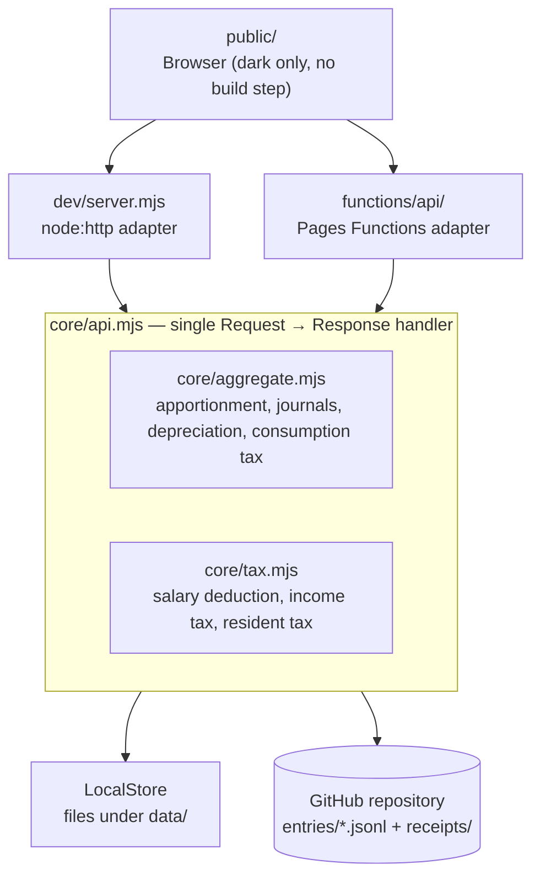

[🇯🇵 日本語](README.md) | [🇬🇧 English](README.en.md)

# etax-prep

[](https://github.com/yktsnet/etax-prep/actions/workflows/ci.yml)

A web app that lets a salaried sole proprietor keep the books for a Japanese blue-return tax filing (¥650k deduction, e-Tax) by **entering nothing but an amount and an account**, deriving double-entry bookkeeping, household-expense apportionment, and the merge with salary income behind the scenes, all the way to figures ready to transcribe onto the return.

## Screenshots

`node dev/server.mjs` reproduces the same screens locally, showing the bundled dummy data.

| Entry | Ledger |
|---|---|
|  |  |
| Type an amount, tap an account, submit. Date, counterparty, and apportionment are prefilled and only opened when needed. Receipts paste in place with ⌘V | Transactions grouped by month, with apportionment ratio and receipt presence on the row. Voided transactions remain struck through — dropped from the totals, never deleted |

| Business | Tax |
|---|---|
|  |  |
| Revenue, expenses, and business income, with a monthly trend and a per-account breakdown. Business figures only, with no salary mixed in | The merge of business and salary income laid out as one chain of arithmetic, through taxable income, income tax, resident tax, and the expected refund. Year-end adjustments pick up receivables and payables that straddle the year |

## Overview

Bookkeeping for a sole proprietorship stalls not because of how much there is to record, but because of **how many decisions each single entry demands**. Debit and credit, tax rate category, apportionment ratio, whether it counts as a fixed asset. Settling all of that on the spot, right after paying, is not realistic — and whatever gets put off becomes a month-end or year-end exercise in remembering.

The later stages — closing, statements, entering figures into e-Tax — are already handled well enough by existing means. A survey of Japanese tax-filing OSS turns up bookkeeping systems with blue-return statements and journals, a local-first PWA journal, and an AI-agent plugin. All of them are thick at the back end and **none is designed as a front door for recording daily expenses in the fewest possible taps**. The tools that *are* light at the front door are household budget apps, which have no chart of accounts.

So: build only the front door, and defer every decision that can be deferred.

| Decided at entry time | Deferred |
|---|---|
| Amount | The credit side (fixed to owner's capital, since no separate business account exists) |
| Account | Apportionment ratio (per-account default applied automatically, overridable later) |
| | Tax rate category (same; the consumption tax method is chosen at year end) |
| | Classification (when unsure, file under miscellaneous and reassign in bulk later) |

The result is that a routine entry takes effectively two actions: **type the amount, tap the account, submit**. The double-entry bookkeeping and balance sheet required for the ¥650k deduction are generated mechanically from this single-entry input.

The target user is a sole proprietor, but not one whose return ends at business income. When salary income exists alongside it, a business loss is offset against that salary, and the tax saved per ¥1 of expense follows the marginal rate on the combined total — so the business books alone do not yield the figures the return needs.

That merge exists for the return, though, not for reading the business. The `Business` tab shows only the business's own figures and never mixes in salary; the combination is separated into the `Tax` tab.

## Architecture



There are two runtimes (local node:http and Cloudflare Pages Functions), but **there is only one copy of the business logic**. Both are thin adapters that call a standard `Request → Response` handler, and the difference between them is confined to the storage backend. Setting `STORE=github` exercises the production path from a local machine.

The source of truth is a GitHub repository: one transaction per JSONL line, one file per receipt. **A single clone brings the complete ledger and all supporting documents to your machine.**

[context/structure.md](context/structure.md) covers the directory layout, storage format, and transaction fields; [context/conventions.md](context/conventions.md) covers the coding conventions (both in Japanese).

## Design Decisions

The full record is in [docs/design-decisions.en.md](docs/design-decisions.en.md). Four decisions sit at the centre.

**Accept single-entry input, convert to double-entry.** The ¥650k deduction requires proper bookkeeping, but asking for debit and credit on every entry defeats the goal of minimum effort. Since no separate business account exists, every expense is paid from personal funds, so the credit side can be fixed to owner's capital. The legal requirement and the lightness of entry are reconciled at exactly this point.

**Cash basis during the year, accrual only at year end.** The ¥650k deduction presupposes accrual accounting and is incompatible with the cash-basis special provision (which caps the deduction at ¥100k). Entering one line on the payment or receipt date during the year, then picking up only the receivables and payables that straddle the year end in December, produces the same result.

**Do not digitise paper; handle only electronic transaction data.** Since January 2024, electronic transaction data must be preserved electronically, while receipts handed over on paper may simply be kept as paper originals. Scanner preservation is an optional scheme, and photographing receipts without meeting its requirements does not let you discard the originals — it just creates duplicate management. **The boundary of the implementation was aligned with the boundary in the regulation.**

**Never destroy a record.** Japan's Electronic Books Preservation Act requires a trail of corrections and deletions. Voiding a transaction sets a flag and detaching a receipt records it in a separate field; neither removes a line or a file. Combined with git history, the record survives twice over.

## Tech Stack

| Technology | Role | Why this one |
|---|---|---|
| Plain ESM JavaScript | Everything | Aggregation is the main event and figures must update the moment an entry lands. A static site generator that aggregates at build time would force a redeploy per entry. No build step and no npm dependencies. |
| Cloudflare Pages + Functions | Hosting | Usable from a phone with no server to maintain. The same setup is already in production on a sibling project. |
| GitHub Contents API | Storage | Git history satisfies the tamper-evidence requirement as-is. Unlike a database, a complete copy always remains locally. |
| Cloudflare Access | Authentication | No authentication is implemented in the app; it is written on the assumption that only requests that cleared Access arrive. |
| JSONL | Ledger format | Trivial to append, splits cleanly per month, and produces readable git diffs. |
| Lucide | Icons | Only the icons in use are inlined as SVG, so nothing reaches a CDN. Emoji do not read as a product. |
| Node's built-in test runner | Testing | Runs with no added dependencies, `Request`/`Response` included. |

## Quick Start

```bash
node dev/server.mjs        # → http://localhost:8099
node --test 'tests/*.test.mjs'
```

Node 24 or later. No dependency installation and no build. Data is stored under `data/` (not tracked by git).

To exercise GitHub-backed storage locally, supply the keys from `.env.example` as environment variables and run `STORE=github node dev/server.mjs`.

## Scope

**In scope**

- Recording expenses and revenue, editing and voiding after the fact, attaching receipts (screenshots)
- Household-expense apportionment, lump-sum depreciation over three years, the small-amount exemption (under ¥300k)
- Account-by-month aggregation, expense breakdown, year-end adjustment for receivables and payables that straddle the year
- Estimating taxable income, income tax, resident tax, and the marginal rate after merging with salary income
- Comparing the three consumption tax methods (exempt, 20% special provision, standard)

**Out of scope**

- Electronic filing or automated data entry into e-Tax. Figures are transcribed by hand into the National Tax Agency's filing site; this app's output stops at "numbers you can transcribe".
- Digitising paper receipts. Originals are kept in an envelope.
- Depreciation of assets over ¥300k (useful-life-based schedules)
- CSV import of bank or credit card statements, OCR of receipt photos
- Multiple businesses or multiple users

**This is built around one person's filing circumstances** (salary income, no separate business account, home apportionment). It will not fit unchanged if those premises differ.

## Guarantees

Contract-level guarantees and the tests backing them are collected in [docs/guarantees.en.md](docs/guarantees.en.md). Behaviour not listed there is not promised.

Tax rates and deduction amounts live in `config/tax-<year>.json`, and the calculation code knows nothing about the year. **The bundled values are for Osaka City and tax year 2026, and are not guaranteed to track annual tax reform.** Verify them against the National Tax Agency's primary sources before each filing. Every figure produced is an estimate and is not a guarantee that a return is correct.

Resident tax differs by municipality in the per-capita levy. See [docs/localization.md](docs/localization.md) (Japanese) for how to adapt the config to your own municipality and tax year.

## Deploy

Cloudflare Pages picks up pushes to main and builds and serves them. GitHub Actions only runs tests and holds no deploy job.

What is configured on the Cloudflare side is the build output directory (`public`) and the environment variables used to write to the ledger repository (see `.env.example` for the keys). Cloudflare Access sits in front, restricted to Google sign-in.

## License

MIT
