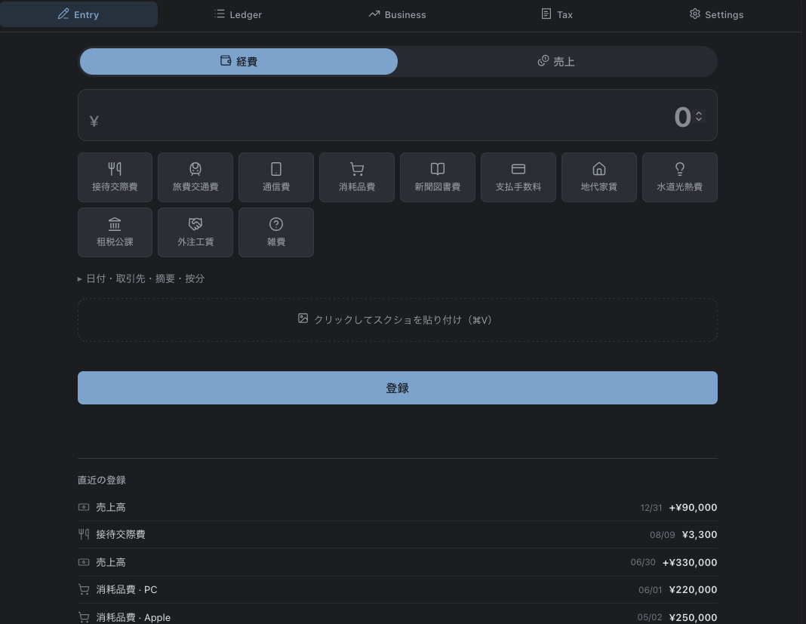
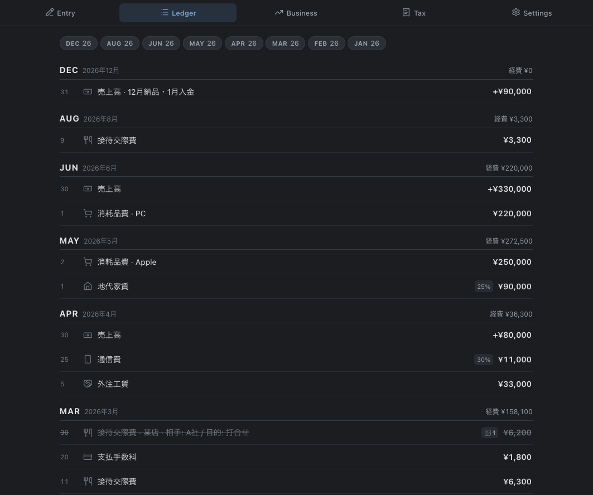
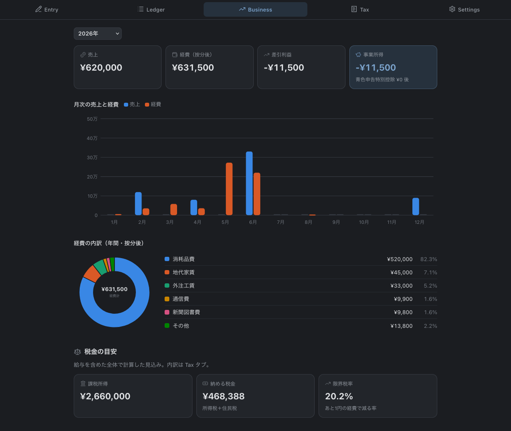
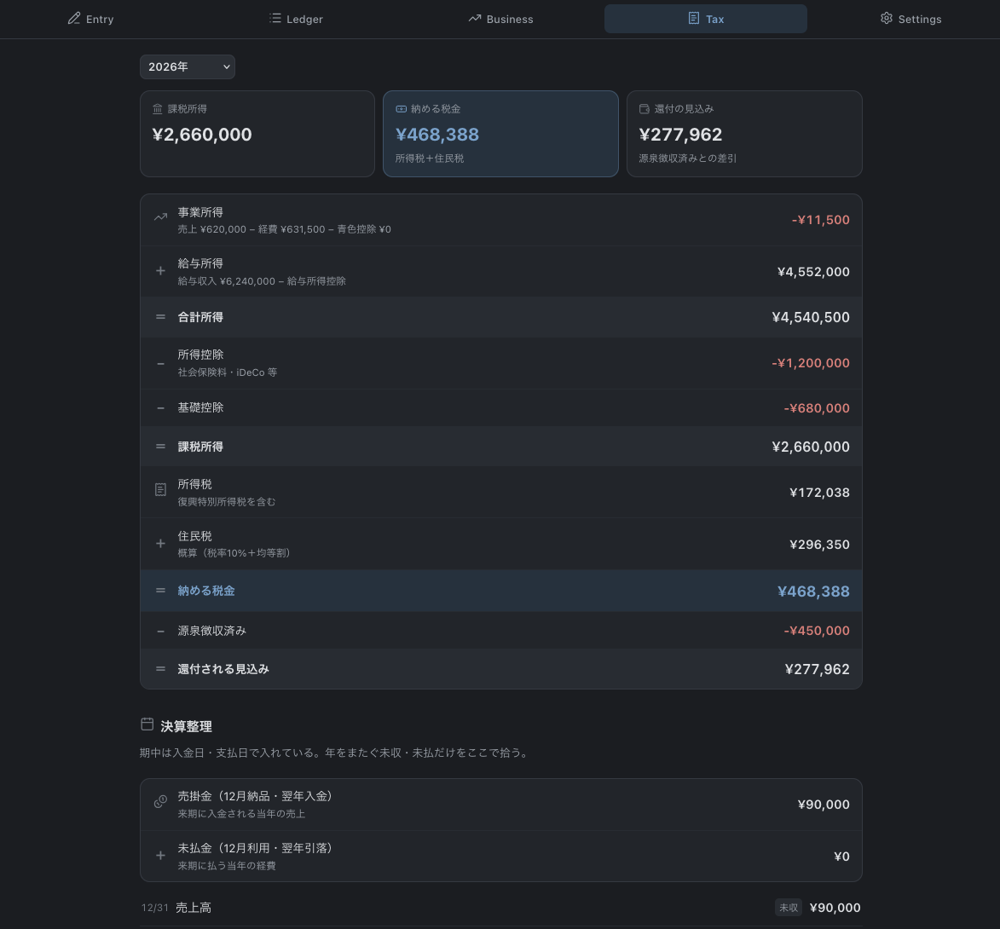
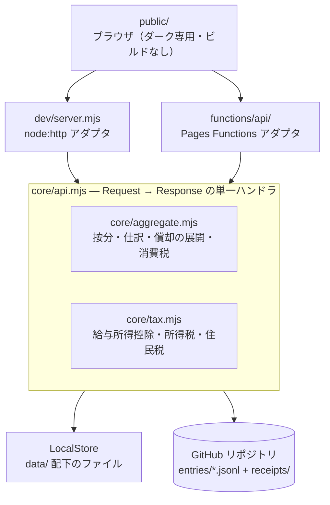

[🇯🇵 日本語](README.md) | [🇬🇧 English](README.en.md)

# etax-prep

[](https://github.com/yktsnet/etax-prep/actions/workflows/ci.yml)

会社員として給与を得ながら、副業で事業所得がある人のための帳簿。確定申告（青色65万・e-Tax）に備える記帳を、**金額と勘定科目だけで打てる Web アプリ**として実装し、複式簿記・家事按分・給与との合算を裏側で導出して申告書へ転記できる集計まで出す。

## Screenshots

`node dev/server.mjs` で同じ画面をローカルに再現できる（同梱のダミーデータを表示している）。

| 入力 | 台帳 |
|---|---|
|  |  |
| 金額を打ち、科目をタップして送信する。日付・取引先・按分は既定値で埋まり、必要なときだけ開く。証憑は貼り付け（⌘V）またはファイル選択でその場に添付できる | 月ごとに取引を並べ、按分率と証憑の有無を行に出す。取消した取引は打ち消し線で残り、集計から外れるだけで消えない |

| 事業 | 申告 |
|---|---|
|  |  |
| 売上・経費・事業所得と、月次推移および科目別内訳。給与を混ぜない事業だけの数字を示す | 事業所得と給与所得の合算から課税所得・所得税・住民税・還付見込みまでを1本の計算過程として並べる。決算整理で年をまたぐ未収・未払を拾う |

## 前提

次の3つを固定してある。汎用の会計 SaaS がこれらを入力のたびに聞くのは、あらゆる利用者を受け入れるためであり、1人分に固定すれば大半は事前に決まる。

- **給与所得が別にある** — 事業の赤字は給与と損益通算され、経費1円あたりの効果も合算後の限界税率で決まる
- **事業用の口座を分けていない** — 費用の支払は常に私費立替であり、貸方は事業主借に固定できる
- **自宅の一部を按分する** — 科目ごとの既定率を自動適用する

運用も自分で行う。帳簿の正本は自分の GitHub リポジトリ、配信は Cloudflare Pages、認証は Cloudflare Access。アカウント登録も DB もない代わりに、**置くのは自分**である。

## Overview

記帳が続かない理由は、記録すべき量ではなく**1件あたりの判断の多さ**にある。借方と貸方、税率区分、按分率、資産計上の可否。支払いを済ませたその場でこれらを決めるのは現実的ではなく、後回しにした分は月末や年度末にまとめて思い出す作業になる。

一方、確定申告の後段（決算・帳票・e-Tax への入力）は既存の手段で足りている。日本の確定申告向け OSS を調べると、青色申告決算書と仕訳帳を備えた帳簿システム、ローカルファーストの PWA 仕訳帳、AI エージェント用プラグインが見つかるが、いずれも後段が厚く、**日々の費用を最小手数で打ち込む入口としては設計されていない**。逆に入口が軽いものは家計簿アプリで、勘定科目を持たない。

前提を1人分に固定できるのは、自分で作る場合だけである。そこで入口だけを作り、判断を後ろへ送った。

| 入力時に決めること | 入力時に決めないこと |
|---|---|
| 金額 | 貸方（事業用口座を分けていないため事業主借に固定） |
| 勘定科目 | 家事按分率（科目ごとの既定値を自動適用、後から上書き可） |
| | 税率区分（同上。課税方式は年末に選ぶ） |
| | 分類（迷ったら雑費で送信し、後でまとめて再割当て） |

結果、日常の入力は **金額を打つ → 科目をタップ → 送信** の実質2アクションで終わる。青色65万控除に必要な複式簿記と貸借対照表は、この単式の入力から機械的に生成する。

申告のほうは事業所得だけで完結しない。給与と損益通算される以上、事業の帳簿だけでは申告に必要な数字が出ないため、給与所得を合算した課税所得・所得税・住民税まで出す。

ただし合算するのは申告のためであって、事業の実態を見るためではない。`Business` タブは事業の数字だけを示して給与を混ぜず、合算は `Tax` タブへ分離してある。

## Architecture



実行環境が2つある（ローカルの node:http と Cloudflare Pages Functions）が、**業務ロジックは1本しかない**。両者は Web 標準の `Request → Response` ハンドラを呼ぶだけのアダプタで、差分は保存先だけに閉じている。`STORE=github` を付ければローカルから本番と同じ経路を検証できる。

保存先の正本は GitHub リポジトリで、1取引が JSONL の1行、証憑が1ファイル。**clone ひとつで帳簿と証憑が完全に手元へ揃う。**

ディレクトリ構成・保存形式・取引のフィールドは [context/structure.md](context/structure.md)、コードの規約は [context/conventions.md](context/conventions.md) にある。

## Design Decisions

判断の全文は [docs/design-decisions.md](docs/design-decisions.md)。中心にあるのは次の4つ。

**単式で受け取り、複式へ変換する。** 65万控除は正規の簿記を要求するが、入力のたびに貸借を指定させると最小手数という目的を損なう。事業用の口座を分けていない以上、費用の支払は常に私費立替であり貸方は事業主借に固定できる。要件と軽さがここで両立する。

**期中は現金主義、年末だけ発生主義へ寄せる。** 65万控除は発生主義が前提で、現金主義の特例（10万控除）とは両立しない。期中は入金日・支払日で1行入れ、12月末に年をまたぐ未収・未払だけを決算整理で拾えば結果は一致する。

**紙は電子化せず、電子取引データだけを扱う。** 2024年1月以降、電子取引データは電子保存が義務である一方、紙で受け取った領収書は原本を紙で保存すれば足りる。スキャナ保存は任意の制度で、要件を満たさないまま写真を撮っても原本を破棄できず二重管理になる。**制度上の切れ目と実装の境界を一致させた。**

**記録を消さない。** 電子帳簿保存法は訂正・削除の履歴を求める。取引の取消はフラグ、証憑の取り外しは退避先への記録で表し、行もファイルも削除しない。git 履歴と併せて二重に残る。

## Tech Stack

| 技術 | 用途 | 選定理由 |
|---|---|---|
| 素の ESM JavaScript | 全体 | 集計が主役で、入力直後に数字が反映される必要がある。ビルド時集計を挟む静的サイト生成は1件の入力ごとに再デプロイを待つことになり噛み合わない。ビルドステップも npm 依存も持たない |
| Cloudflare Pages ＋ Functions | ホスティング | サーバーを維持せずスマホから使える。`hi` で同一構成の運用実績がある |
| GitHub Contents API | 保存 | git 履歴が改ざん防止要件をそのまま満たす。DB を持つ構成と違い、ローカルへ完全な写しが残る |
| Cloudflare Access | 認証 | アプリ側に認証を実装しない。Access を通った要求だけが届く前提で書く |
| JSONL | 帳簿形式 | 追記が単純で、月ごとに分割でき、git の差分が読める |
| Lucide | アイコン | 使う分だけ SVG を同梱し、CDN へ出ない。絵文字ではプロダクトの体裁が出ない |
| Node 標準テストランナー | テスト | `Request`/`Response` を含め、追加の依存なしに走る |

## Quick Start

```bash
node dev/server.mjs        # → http://localhost:8099
node --test 'tests/*.test.mjs'
```

Node 24 以上。依存パッケージのインストールもビルドも要らない。保存先は `data/` 配下（git 管理外）になる。

本番と同じ GitHub 経由の保存を手元で試す場合は、`.env.example` のキーを環境変数に与えて `STORE=github node dev/server.mjs` を実行する。

## Scope

**扱うもの**

- 経費と売上の記帳、事後の編集と取消、証憑（スクショ）の添付
- 家事按分、一括償却（3年均等）、少額特例（30万円未満）
- 勘定科目×月の集計、経費の内訳、年をまたぐ未収・未払の決算整理
- 給与所得との合算による課税所得・所得税・住民税・限界税率の試算
- 消費税の3方式（免税・2割特例・本則）の比較

**扱わないもの**

- e-Tax への電子申告・自動入力。確定申告書等作成コーナーへ手で転記する前提で、本アプリの出口は「転記できる数字」まで
- 紙のレシートの電子化。封筒で原本を保管する
- 30万円以上の資産の減価償却（耐用年数別の償却計算）
- 銀行・クレジット明細の CSV 取込、レシート写真の OCR
- 複数事業者・複数ユーザー

冒頭の[前提](#前提)に合わせて作ってある。前提が違う場合はそのままでは使えない。

## Guarantees

契約面の保証と対応するテストは [docs/guarantees.md](docs/guarantees.md) にまとめてある。ここに載っていない振る舞いは約束ではない。

税率・控除額は `config/tax-<年>.json` に切り出してあり、計算コードは年を知らない。**同梱の値は大阪市・2026年分のもので、毎年の改正に追従する保証をしない。** 各年分の申告前に国税庁の一次情報で必ず裏を取ること。算出される税額はいずれも見込みであり、申告内容の正しさを保証するものではない。

住民税は自治体によって均等割の上乗せ額が違う。自分の自治体・年分に合わせる手順は [docs/localization.md](docs/localization.md)。

## Deploy

main への push を Cloudflare Pages が検知してビルド・配信する。GitHub Actions 側はテストのみを回し、デプロイ job を持たない。

Cloudflare 側で設定するのは、ビルド出力ディレクトリ（`public`）と、帳簿リポジトリへ書き込むための環境変数（キーは `.env.example` を参照）。前段に Cloudflare Access を置き、Google ログインで絞る。

## License

MIT
